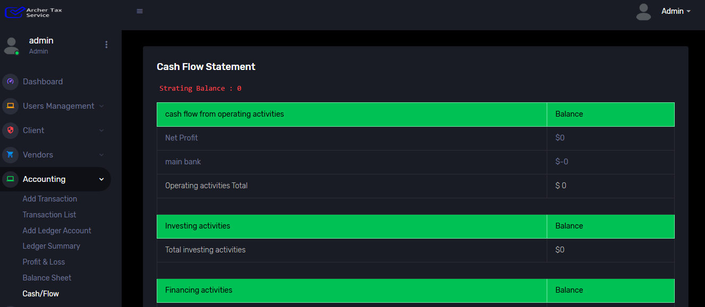
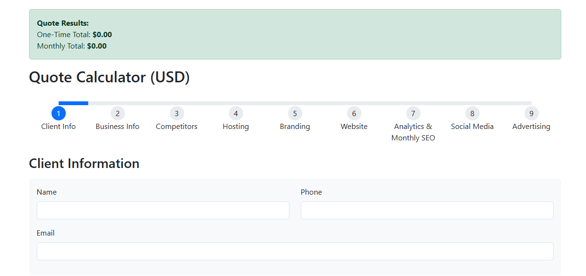
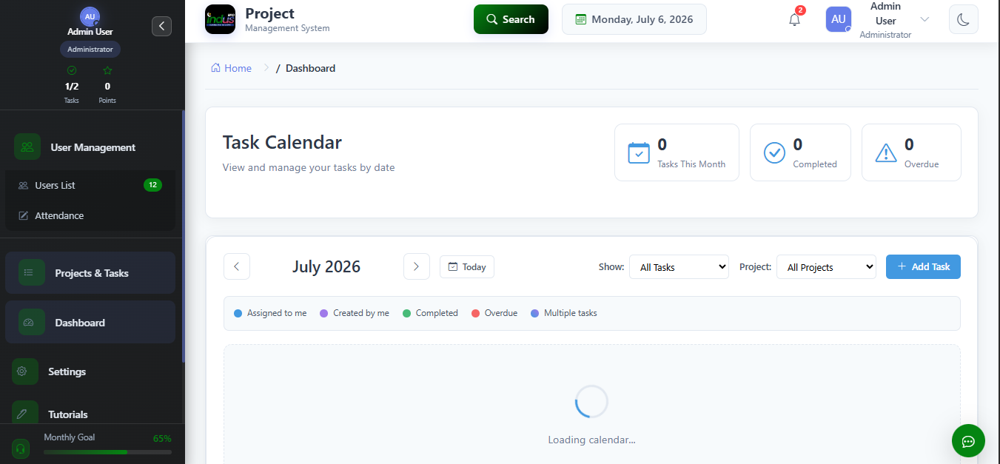
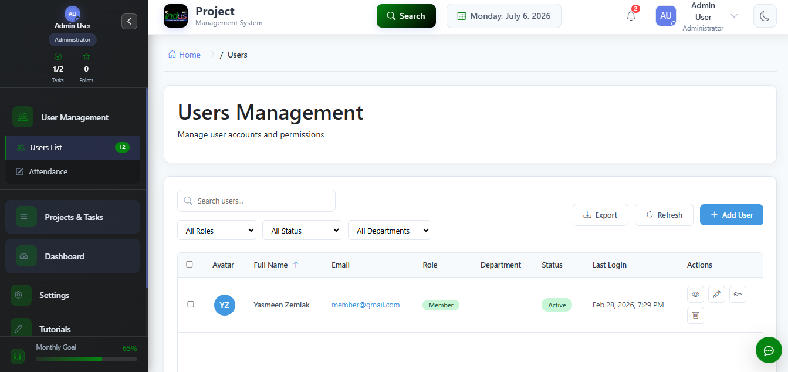

# ERP System

> Enterprise Resource Planning (ERP) platform consisting of three interconnected web applications and a centralized employee task management system.

---

# Overview

The ERP System is a suite of enterprise applications developed to streamline business operations across multiple departments. The system is composed of three independent portals that communicate with one another through shared services and APIs.

The platform centralizes business workflows while allowing each department to operate independently within its own application.

---

# Project Status

**Completed**

---

# Business Goal

The objective was to replace fragmented workflows with a centralized ERP ecosystem capable of handling daily business operations, employee collaboration, and department-specific processes.

---

# System Modules

### Insurance Portal

- Insurance management
- Customer records
- Policy workflows
- Reporting

---

### Accounting Portal

- Financial operations
- Payment management
- Reports
- Business transactions

---

### Query Portal

- Customer queries
- Request management
- Internal communication
- Workflow tracking

---

### Employee Task Management

Shared across all portals.

Features include:

- Task assignments
- Internal messaging
- Notifications
- Activity tracking
- Cross-portal communication

---

# My Contributions

As a Full Stack Laravel Developer, I contributed to:

- Backend development
- Frontend development
- Dashboard development
- REST API integration
- Database design
- Query optimization
- Performance optimization
- Authentication
- Authorization
- Role & Permission Management
- Bug fixing
- Feature implementation
- UI improvements
- Testing
- Deployment support

---

# Technology Stack

## Backend

- Laravel
- PHP

## Frontend

- Bootstrap
- JavaScript
- jQuery
- HTML5
- CSS3

## Database

- MySQL

## APIs

- REST APIs

## Version Control

- Git
- GitHub

---

# Key Features

- Enterprise Dashboard
- Multi-Portal Architecture
- Shared Employee System
- Authentication & Authorization
- Role-Based Access Control (RBAC)
- Reports
- Analytics
- Search & Filters
- Notifications
- User Management
- Secure APIs
- Performance Optimizations

---

# Architecture

```
                     ERP SYSTEM

          ┌────────────────────────┐
          │ Employee Task Manager  │
          └──────────┬─────────────┘
                     │
      ┌──────────────┼──────────────┐
      │              │              │
      ▼              ▼              ▼
Insurance      Accounting      Query Portal
   Portal          Portal
```

Each application communicates using shared APIs and a centralized employee management system.

---

# Technical Challenges

Some notable engineering challenges included:

- Building communication between multiple independent applications.
- Designing scalable database relationships.
- Optimizing complex SQL queries.
- Maintaining consistent authentication across modules.
- Developing reusable components.
- Improving dashboard performance.

---

# Screenshots

## Dashboard


---

## Insurance Portal


---

## Accounting Portal



---

## Query Portal



---

## Employee Task Manager



---

## Reports


---

## User Management



---

# Results

- Successfully delivered a production-ready ERP ecosystem.
- Improved workflow management across departments.
- Reduced manual processes through automation.
- Enabled communication between multiple business applications.
- Built scalable architecture for future expansion.

---

# Confidentiality Notice

The source code for this project is proprietary and owned by the respective employer/client.

This repository contains only documentation and screenshots for portfolio purposes.

No proprietary code, confidential business logic, credentials, or customer data are included.
