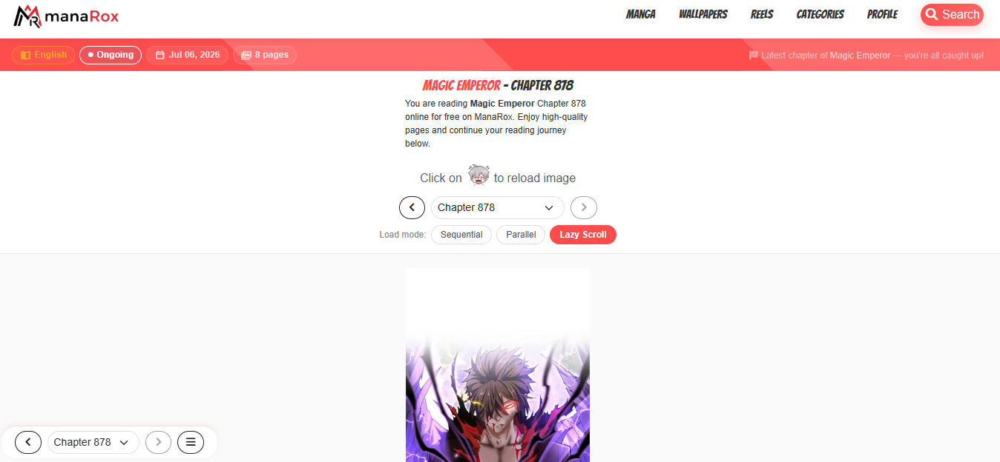
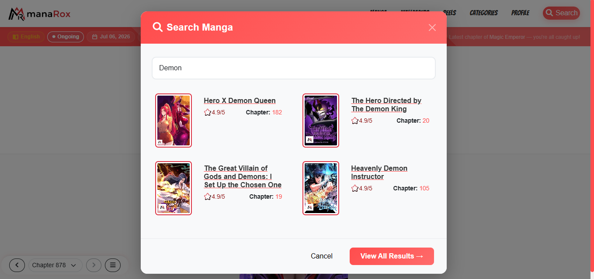
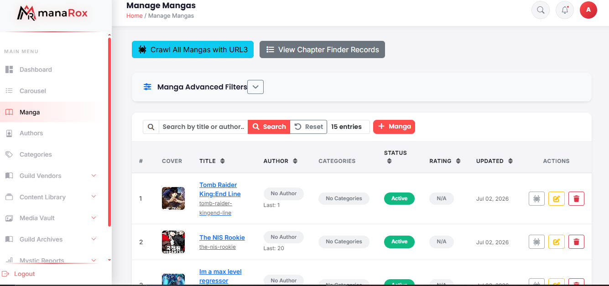
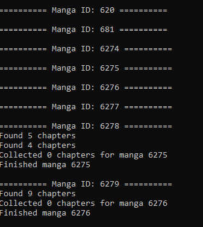
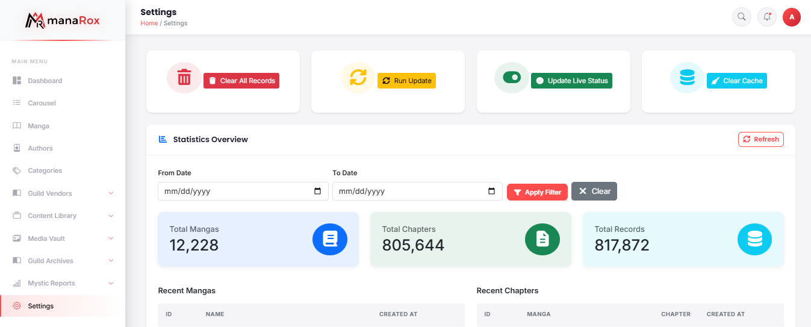

# Manga Reader Platform

> A large-scale manga aggregation and reading platform built with Laravel, featuring automated content collection, Cloudflare R2 object storage, advanced search, and support for **900,000+ indexed content pages**.

---

# Overview

The Manga Reader Platform is a high-scale web application designed to aggregate, organize, and deliver manga content through an intuitive reading experience.

The platform automates content collection, media processing, storage management, and search indexing while providing users with fast page loading, responsive reading, and efficient content discovery.

One of the primary engineering challenges was designing a system capable of managing **over 900,000 indexed content pages** while maintaining performance and scalability.

---

# Project Status

✅ **Completed**

---

# Business Goal

The goal of the platform was to build a scalable manga ecosystem capable of:

- Managing massive amounts of content
- Automating content updates
- Delivering fast reading performance
- Providing an intuitive browsing experience
- Reducing storage costs using cloud object storage

---

# Project Statistics

| Metric | Value |
|---|---:|
| Indexed Content Pages | **900,000+** |
| Storage | Cloudflare R2 |
| Framework | Laravel |
| Scraping Engine | Python & PHP |
| Database | MySQL |
| Search | Optimized Database Search |

---

# Core Features

## Home Page

- Latest updates
- Popular manga
- Featured series
- Categories
- Recently added content

---

## Manga Details

- Manga information
- Chapters
- Genres
- Ratings
- Author information
- Status

---

## Reader

- Responsive manga reader
- Fast image loading
- Chapter navigation
- Mobile-friendly interface

---

## Search

- Keyword search
- Genre filtering
- Status filtering
- Alphabetical browsing
- Advanced search

---

## Admin Dashboard

- Content management
- Chapter management
- User management
- Statistics
- Scraper management
- System monitoring

---

## Automated Content Collection

- Automated manga discovery
- Chapter updates
- Metadata collection
- Image processing
- Scheduled jobs
- Data validation

---

## Cloudflare R2 Integration

- Object storage
- Image delivery
- Reduced hosting costs
- Scalable media storage
- Optimized asset management

---

# My Contributions

As a Full Stack Laravel Developer, I contributed to:

- Backend development
- Frontend development
- Python automation
- Web scraping
- Content aggregation
- Cloudflare R2 integration
- Database design
- Performance optimization
- Query optimization
- Search optimization
- REST API integration
- Dashboard development
- Admin panel development
- Bug fixing
- UI improvements
- Deployment support

---

# Technology Stack

## Backend

- Laravel
- PHP
- Python

## Frontend

- Bootstrap
- JavaScript
- jQuery
- HTML5
- CSS3

## Database

- MySQL

## Cloud

- Cloudflare R2

## Automation

- Python
- Scheduled Jobs
- Data Collection

## Version Control

- Git
- GitHub

---

# Key Features

- 900,000+ Indexed Content Pages
- Automated Content Collection
- High-Speed Reader
- Cloudflare R2 Integration
- Advanced Search
- Admin Dashboard
- User Management
- Responsive Design
- Performance Optimization
- Image Optimization
- SEO-Friendly URLs
- Caching
- Queue Processing

---

# System Architecture

```text
                  Internet Sources
                         │
                         ▼
              Python Scraping Engine
                         │
                         ▼
              Data Processing Pipeline
                         │
                         ▼
                     MySQL Database
                         │
         ┌───────────────┴───────────────┐
         │                               │
         ▼                               ▼
 Laravel Application            Cloudflare R2
         │                               │
         └───────────────┬───────────────┘
                         ▼
                    End Users
```

---

# Technical Challenges

Some engineering challenges addressed during development include:

- Managing over **900,000 content pages** efficiently.
- Optimizing database queries for fast search results.
- Building reliable automated data collection workflows.
- Integrating Cloudflare R2 for scalable media storage.
- Optimizing image delivery and loading performance.
- Handling large datasets while maintaining application responsiveness.
- Designing an admin panel for efficient content management.

---

# Screenshots

## Home


---

## Manga Details


---

## Reader


---
## Chapter



---

## Search



---

## Admin Dashboard



---

## Python Scraping



---


## Platform Statistics



---

# Results

- Successfully built a scalable manga aggregation platform.
- Managed **900,000+ indexed content pages**.
- Automated content collection and updates.
- Reduced storage costs using Cloudflare R2.
- Optimized application performance for large datasets.
- Delivered a responsive reading experience across desktop and mobile devices.

---

# Confidentiality Notice

This repository contains documentation and screenshots only.

The source code, scraping implementation details, proprietary business logic, and deployment configuration remain the intellectual property of the respective owner.

No confidential information or proprietary source code is included.