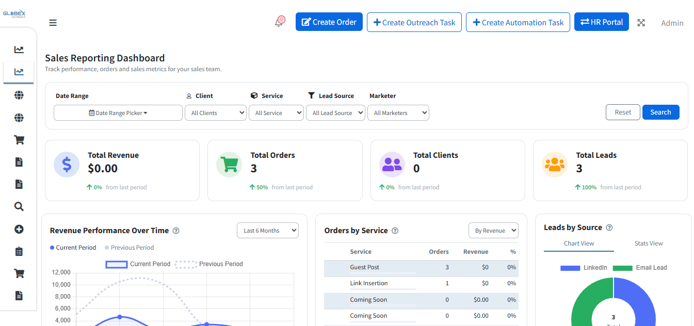
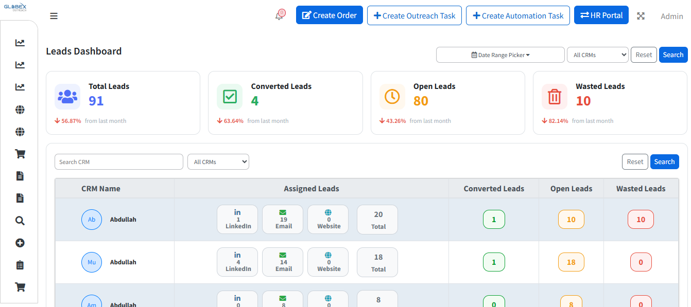
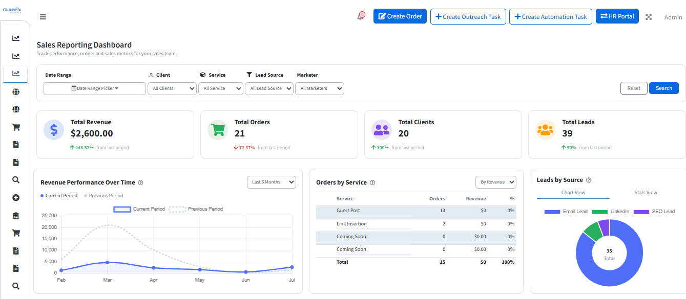
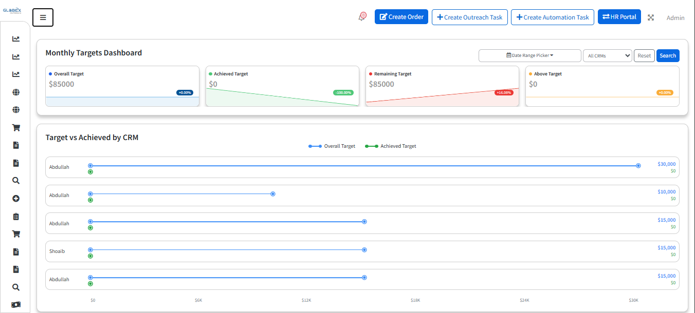

# Internal Business Portal

> A comprehensive internal business platform that centralizes lead management, CRM, marketing, helpdesk, inventory, blogging, and business analytics into a single application.

---

# Overview

The Internal Business Portal is a modular enterprise web application designed to streamline daily business operations through a unified interface. The platform combines multiple business tools into one system, enabling teams to manage customers, support requests, inventory, content, and reporting efficiently.

The project is currently under active development, with new modules and features being added continuously.

---

# Project Status

🚧 **Currently in Active Development**

---

# Business Goal

The objective of the platform is to eliminate the need for multiple disconnected systems by providing a centralized solution for managing internal operations, customer relationships, employee workflows, and business reporting.

---

# Core Modules

## Dashboard

- Business overview
- KPIs and statistics
- Recent activity
- Quick actions

---

## CRM

- Customer management
- Contact management
- Sales pipeline
- Activity tracking

---

## Lead Management

- Lead generation
- Lead assignment
- Lead tracking
- Follow-up management

---

## Helpdesk

- Support ticket management
- Ticket assignment
- Status tracking
- Customer communication

---

## Inventory Management

- Product management
- Stock tracking
- Inventory reports
- Category management

---

## Blogging Module

- Blog management
- Categories
- SEO-friendly articles
- Rich text editor

---

## Analytics & Reporting

- Business reports
- Performance metrics
- Charts & graphs
- Custom filters

---

# My Contributions

As a Full Stack Laravel Developer, I contributed to:

- Backend development
- Frontend development
- Dashboard development
- CRM implementation
- Lead Management module
- Helpdesk module
- Inventory Management
- Blogging module
- REST API development
- Database design
- Query optimization
- Performance optimization
- Authentication
- Authorization
- Role & Permission Management
- UI/UX improvements
- Bug fixing
- Feature implementation
- Testing

---

# Technology Stack

## Backend

- Laravel
- PHP

## Frontend

- Bootstrap
- JavaScript
- jQuery
- HTML5
- CSS3

## Database

- MySQL

## APIs

- REST APIs

## Version Control

- Git
- GitHub

---

# Key Features

- Modular Architecture
- CRM System
- Lead Management
- Helpdesk
- Inventory Management
- Blogging Platform
- Dashboards
- Business Analytics
- Reports
- User Management
- Authentication & Authorization
- Role-Based Access Control (RBAC)
- Search & Filtering
- Notifications
- Responsive Design

---

# Architecture

```text
               Internal Business Portal

                    Dashboard
                        │
        ┌───────────────┼────────────────┐
        │               │                │
        ▼               ▼                ▼
      CRM            Leads         Helpdesk
        │               │                │
        └───────────────┼────────────────┘
                        │
                        ▼
                  Inventory
                        │
                        ▼
                     Blogging
                        │
                        ▼
                Analytics & Reports
```

---

# Technical Challenges

Some engineering challenges addressed during development include:

- Designing a scalable modular architecture.
- Maintaining performance as new modules were introduced.
- Optimizing complex database queries.
- Implementing reusable components across modules.
- Managing role-based permissions for multiple user types.
- Creating dynamic dashboards and reporting systems.

---

# Screenshots

## Dashboard



---


## Lead Management



---

## Helpdesk


---

## Sales Report




---
## CRM



---
# Current Progress

The platform is actively being expanded with additional modules, workflow improvements, and reporting capabilities. Existing modules continue to receive feature enhancements and performance optimizations.

---

# Confidentiality Notice

The source code for this project is proprietary and owned by the respective employer/client.

This repository contains only documentation and screenshots for portfolio purposes.

No proprietary source code, confidential business logic, credentials, or customer data are included.