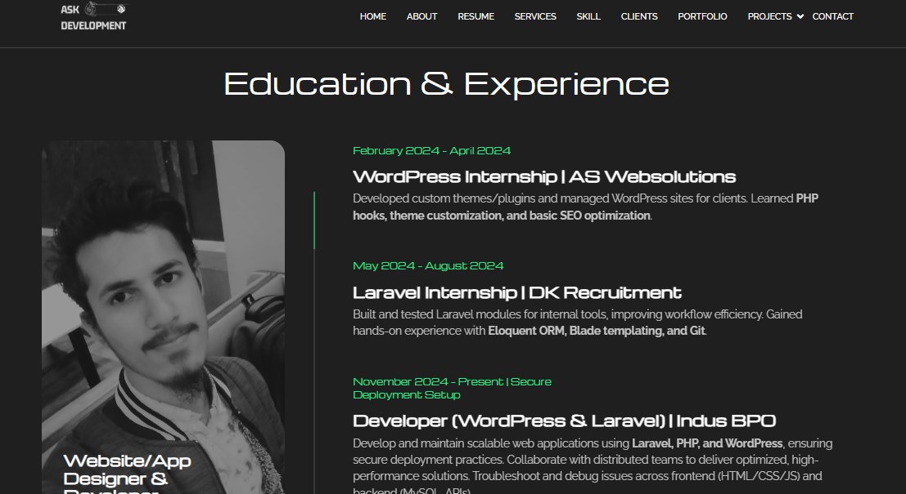
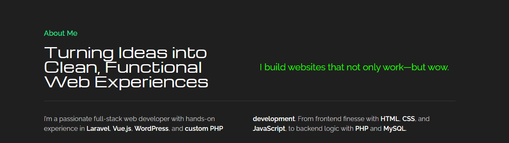
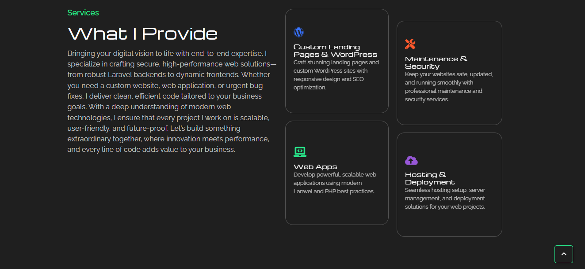
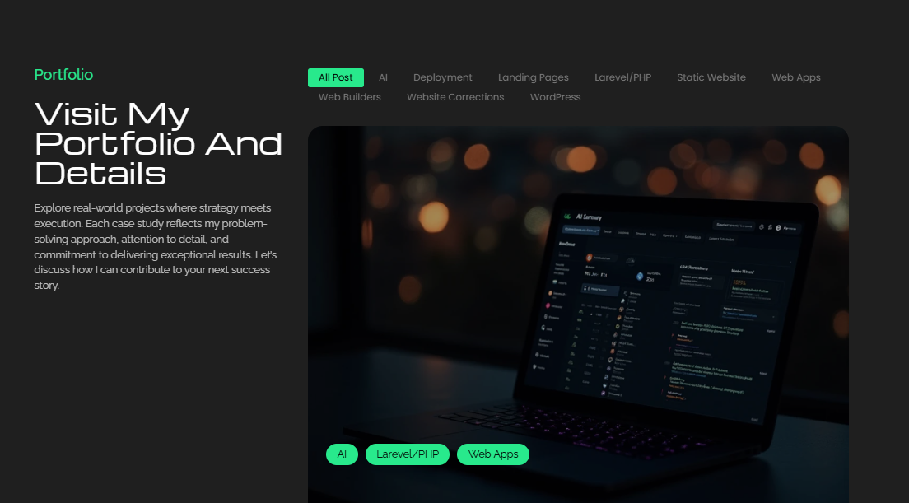
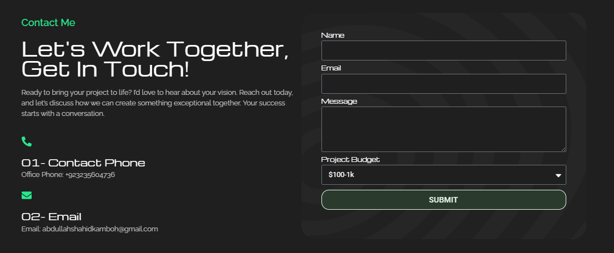
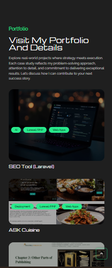

# WordPress Portfolio Website

> A modern, responsive portfolio website built with WordPress, showcasing professional services, projects, and contact information with a clean, SEO-friendly design.

---

# Overview

The WordPress Portfolio Website is designed to establish a strong online presence for freelancers, developers, agencies, or businesses. It provides an elegant way to showcase projects, services, skills, and contact information while ensuring excellent performance across desktop and mobile devices.

The project focuses on responsive design, user experience, search engine optimization, and easy content management through the WordPress CMS.

---

# Project Status

✅ **Completed**

---

# Business Goal

The objective of the project was to build a professional portfolio website capable of:

- Showcasing projects and achievements
- Presenting services professionally
- Increasing online visibility
- Generating client inquiries
- Providing a fully responsive experience
- Allowing easy content management without coding

---

# Project Statistics

| Metric | Value |
|---|---:|
| Platform | WordPress |
| CMS | WordPress |
| Theme | Custom Theme |
| Responsive Design | Yes |
| SEO Optimized | Yes |
| Contact Form | Included |

---

# Core Features

## Home

- Modern landing page
- Hero section
- Featured projects
- Services overview
- Call-to-action sections

---

## About

- Personal or company introduction
- Skills & experience
- Mission & vision
- Professional background

---

## Services

- Service listings
- Detailed service descriptions
- Pricing or consultation section
- Call-to-action buttons

---

## Portfolio

- Project showcase
- Image gallery
- Project categories
- Individual project details

---

## Contact

- Contact form
- Business information
- Social media links
- Google Maps integration
- Quick inquiry section

---

## Responsive Design

- Mobile-first layout
- Tablet optimization
- Desktop optimization
- Cross-browser compatibility

---

# My Contributions

As a Web Developer, I contributed to:

- WordPress development
- Theme customization
- Responsive UI implementation
- Landing page development
- Portfolio section development
- Contact page implementation
- Performance optimization
- SEO optimization
- Plugin configuration
- Speed optimization
- Mobile responsiveness
- Bug fixing
- Deployment support

---

# Technology Stack

## CMS

- WordPress

## Frontend

- HTML5
- CSS3
- JavaScript
- Bootstrap

## Backend

- PHP

## Database

- MySQL

## Plugins

- Contact Form
- SEO Plugin
- Caching Plugin

## Version Control

- Git
- GitHub

---

# Key Features

- Responsive Design
- Modern UI
- SEO Friendly
- Portfolio Showcase
- Services Section
- Contact Form
- Mobile Optimized
- Performance Optimized
- Easy Content Management
- Cross-Browser Compatibility

---

# System Architecture

```text
               Website Visitors
                      │
                      ▼
             WordPress Frontend
                      │
        ┌─────────────┴─────────────┐
        │                           │
        ▼                           ▼
  Custom Theme                WordPress Plugins
        │                           │
        └─────────────┬─────────────┘
                      ▼
                MySQL Database
```

---

# Technical Challenges

Some engineering challenges addressed during development include:

- Building a fully responsive layout across all screen sizes.
- Customizing WordPress themes without affecting maintainability.
- Optimizing website speed and Core Web Vitals.
- Improving SEO structure and metadata.
- Ensuring compatibility across major browsers.
- Creating reusable page sections for easy content updates.
- Maintaining a clean and user-friendly interface.

---

# Screenshots

## Home



---

## About



---

## Services



---

## Portfolio



---

## Contact



---

## Mobile View



---

# Results

- Successfully developed a professional WordPress portfolio website.
- Delivered a responsive experience across desktop, tablet, and mobile devices.
- Improved website performance and SEO readiness.
- Built reusable and easily manageable content sections.
- Created a modern interface suitable for freelancers, agencies, and businesses.

---

# Confidentiality Notice

This repository contains documentation and screenshots only.

The original source code, premium themes, licensed plugins, client-specific assets, deployment configuration, and proprietary business content remain the intellectual property of the respective owner.

No confidential information or proprietary source code is included.